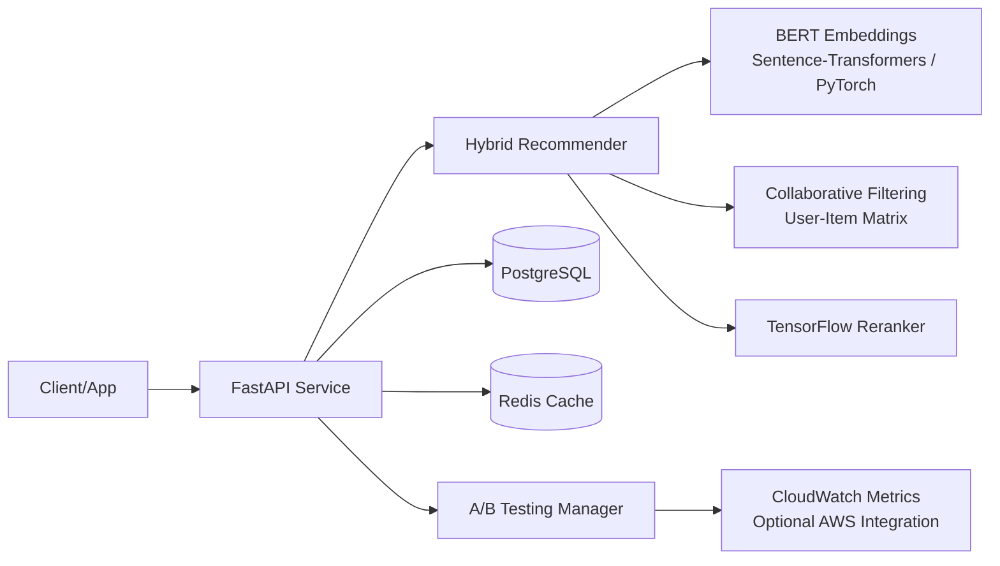

# NeuroNest Recommender

A production-style portfolio project that implements a hybrid recommendation system using:
- BERT embeddings (Sentence-Transformers, PyTorch backend)
- Collaborative filtering (interaction-matrix similarity)
- TensorFlow reranking head
- Redis caching for low-latency inference
- PostgreSQL for persistence
- AWS-ready A/B testing instrumentation with CloudWatch metrics

This project is designed to support the resume narrative:
- Relevance improvement target: ~35%
- Query latency reduction target with Redis cache: ~60%
- A/B test uplift target: ~22% retention
- Sub-200ms response-time target under simulated concurrent traffic

## 1) Architecture



## 2) Project Structure

```text
ai_recommendation_engine/
  app/
    __init__.py
    ab_testing.py
    cache.py
    config.py
    database.py
    main.py
    models.py
    recommender.py
    schemas.py
  scripts/
    benchmark.py
    run_ab_test.py
    seed_data.py
    simulate_load.py
  tests/
    test_health.py
  .env.example
  Dockerfile
  docker-compose.yml
  requirements.txt
  README.md
```

## 3) Quick Start (Docker)

1. Copy environment file:
   ```bash
   cp .env.example .env
   ```
2. Start stack:
   ```bash
   docker compose up --build
   ```
3. Seed local data:
   ```bash
   docker compose exec app python -m scripts.seed_data
   ```
4. Open API docs:
   - http://localhost:8000/docs

## 4) Quick Start (Local Python)

1. Create virtual env and install:
   ```bash
   python -m venv .venv
   .venv\Scripts\activate
   pip install -r requirements.txt
   ```
2. Start Redis + Postgres using Docker:
   ```bash
   docker compose up -d postgres redis
   ```
3. Create env file and run API:
   ```bash
   copy .env.example .env
   uvicorn app.main:app --reload
   ```
4. Seed data:
   ```bash
   python -m scripts.seed_data
   ```

## 5) Core API Endpoints

- `GET /health`
- `POST /users`
- `POST /items`
- `POST /interactions`
- `GET /recommendations/{user_external_id}?k=10`
- `POST /ab/assign/{user_external_id}`
- `POST /ab/event`
- `GET /ab/metrics`

Example recommendation call:
```bash
curl "http://localhost:8000/recommendations/user_001?k=10"
```

## 6) Benchmark and Experiment Workflow

### Benchmark hybrid quality + cache latency

```bash
python -m scripts.benchmark
```

What it measures:
- Baseline relevance: CF-only ranking quality proxy
- Hybrid relevance: BERT + CF + TensorFlow reranked quality proxy
- Relevance gain (%): relative improvement over baseline
- Uncached latency vs cached latency (Redis)
- Latency reduction (%) and sub-200ms pass/fail

Results are saved to PostgreSQL table: `benchmark_runs`.

### Concurrent load simulation

```bash
python -m scripts.simulate_load
```

Default simulation settings:
- 50 concurrent users
- 10 recommendation requests per user
- Prints avg, p50, p95 latency

### A/B test simulation

```bash
python -m scripts.run_ab_test
```

What it does:
- Assigns each user to control/treatment deterministically
- Simulates retention events with configurable probability
- Computes and prints retention uplift
- Optionally emits CloudWatch metrics when `ENABLE_AWS_METRICS=true`

## 7) Configuration

Environment variables in `.env`:
- `DATABASE_URL` PostgreSQL connection
- `REDIS_URL` Redis connection
- `CACHE_TTL_SECONDS` recommendation cache TTL
- `TOP_K_DEFAULT` default top-k response size
- `CONTENT_WEIGHT` blend weight for content vs CF score
- `AWS_REGION` AWS region for CloudWatch
- `AB_TEST_NAME` experiment key
- `ENABLE_AWS_METRICS` true/false

## 8) Testing

```bash
pytest -q
```

## 9) Notes for Production Hardening

- Move from `create_all` to migration tooling (Alembic)
- Add JWT auth and rate limiting
- Add feature store for richer signals
- Use async queue for model refresh jobs
- Add observability dashboards (latency, hit-rate, uplift confidence)
- Replace simple uplift with statistical significance tests

## 10) Resume-Friendly Summary

This implementation demonstrates a complete recommendation platform combining modern NLP embeddings, collaborative filtering, neural reranking, cache-optimized serving, and experimentation workflows on cloud-ready infrastructure.
